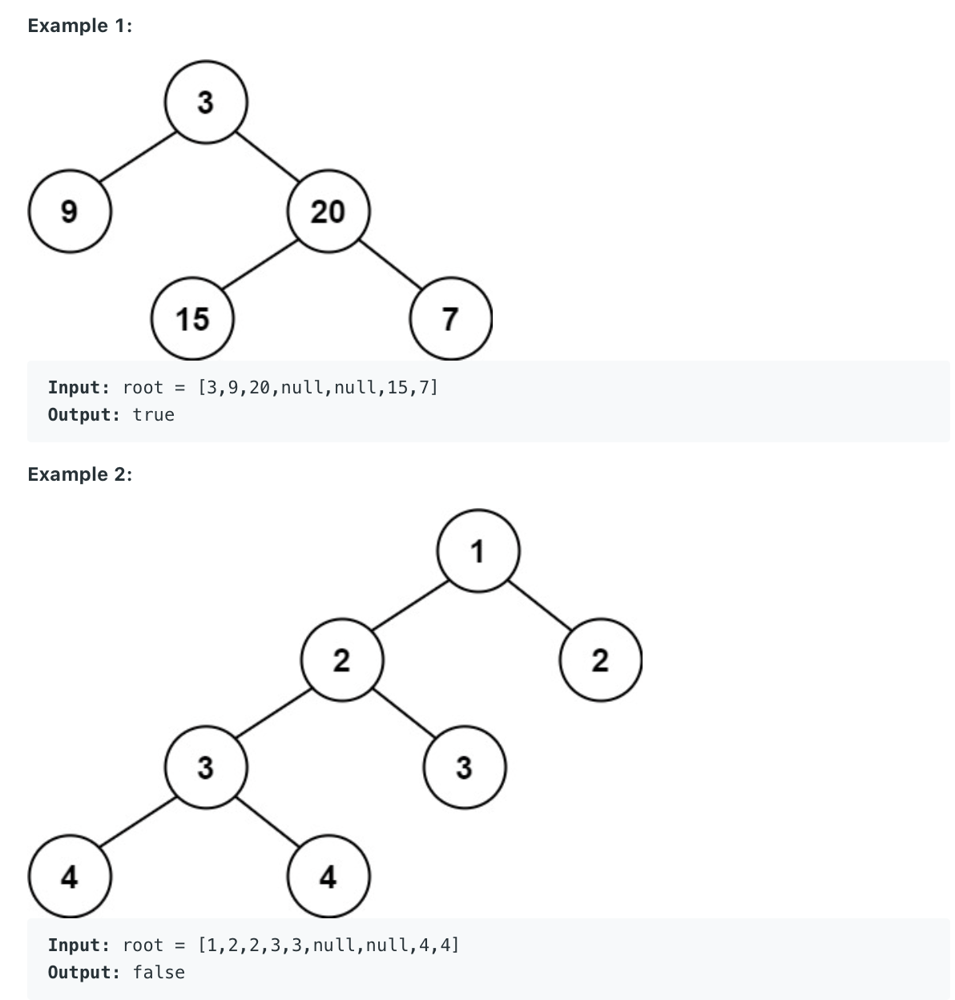

110. Balanced Binary Tree
     
Easy

Given a binary tree, determine if it is height-balanced.

For this problem, a height-balanced binary tree is defined as:

a binary tree in which the left and right subtrees of every node differ in height by no more than 1.



Example 3:
```
Input: root = []
Output: true
```
 

Constraints:

- The number of nodes in the tree is in the range [0, 5000].

- 104 <= Node.val <= 10^4

## Method 1: from root to leaves

(Depth here means distance to root node)

When go to next level of recursion, pass depth+1 to next level.

When meets recursion stopping condition (leaves), return curr depth (leave node's depth). Then at upper level, uses the return value as **subtree** depth.

Subtree depth = return value of next level

```py
# Definition for a binary tree node.
# class TreeNode:
#     def __init__(self, val=0, left=None, right=None):
#         self.val = val
#         self.left = left
#         self.right = right
class Solution:
    def isBalanced(self, root: Optional[TreeNode]) -> bool:
        if not root:
            return True
        
        boolean, _ = self.dfs(root, 0)
        return boolean
        
    def dfs(self, curr_node, curr_nodeheight):
        if not curr_node:
            return True, curr_nodeheight
        
        boolean_left, leftheight = self.dfs(curr_node.left, curr_nodeheight + 1)
        boolean_right, rightheight = self.dfs(curr_node.right, curr_nodeheight + 1)
            
        curr_nodeheight = max(leftheight, rightheight)
        # print(curr_node.val, boolean_left, boolean_right, leftheight, rightheight)
        if not boolean_left or not boolean_right:
            return False, curr_nodeheight
        if abs(leftheight - rightheight) > 1:
            return False, curr_nodeheight
        return True, curr_nodeheight
```


## Method 2 : from leaves to root:


(Depth here means distance to leave node)

When go to next level of recursion, pass nothing to next level.

When meets recursion stopping condition (leaves), return 0. Then at upper level, get the return value then + 1 as curr level depth.

```
Upper level depth (curr depth) = lower level depth + 1
```

```py
# Definition for a binary tree node.
# class TreeNode:
#     def __init__(self, val=0, left=None, right=None):
#         self.val = val
#         self.left = left
#         self.right = right
class Solution:
    def isBalanced(self, root: Optional[TreeNode]) -> bool:
        if not root:
            return True
        
        boolean, _ = self.dfs(root)
        return boolean
        
    def dfs(self, curr_node):
        if not curr_node:
            return True, 0
        
        boolean_left, leftheight = self.dfs(curr_node.left) 
        boolean_right, rightheight = self.dfs(curr_node.right) 
            
        curr_nodeheight = max(leftheight, rightheight) + 1
        # print(curr_node.val, boolean_left, boolean_right, leftheight, rightheight)
        if not boolean_left or not boolean_right:
            return False, curr_nodeheight
        if abs(leftheight - rightheight) > 1:
            return False, curr_nodeheight
        return True, curr_nodeheight
```