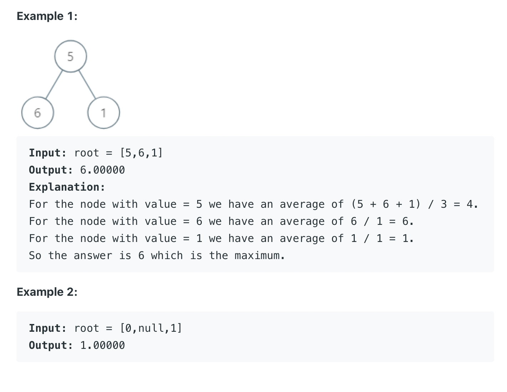

1120. Maximum Average Subtree

Medium

Given the root of a binary tree, return the maximum average value of a subtree of that tree. Answers within 10-5 of the actual answer will be accepted.

A subtree of a tree is any node of that tree plus all its descendants.

The average value of a tree is the sum of its values, divided by the number of nodes.


Constraints:

- The number of nodes in the tree is in the range [1, 104].
- 0 <= Node.val <= 10^5

```py

# Definition for a binary tree node.
# class TreeNode:
#     def __init__(self, val=0, left=None, right=None):
#         self.val = val
#         self.left = left
#         self.right = right
class Solution:
    def maximumAverageSubtree(self, root: Optional[TreeNode]) -> float:
        if not root:
            return root.val
        
        all_subtree_avgs = []
        self.dfs(root, all_subtree_avgs)
        return max(all_subtree_avgs)
    
    def dfs(self, curr_node, all_subtree_avgs):
        if not curr_node.left and not curr_node.right:
            all_subtree_avgs.append(curr_node.val)
            return [curr_node.val]
        
        all_left_children, all_right_children = [], [] 
        if curr_node.left:
            all_left_children.extend(self.dfs(curr_node.left, all_subtree_avgs))
        if curr_node.right:
            all_right_children.extend(self.dfs(curr_node.right, all_subtree_avgs))
        
        #dc
        all_subtree_node_values = all_left_children + all_right_children  + [curr_node.val]
        currnode_subtree_avg = sum(all_subtree_node_values) / len(all_subtree_node_values)#idea starts here
        all_subtree_avgs.append(currnode_subtree_avg)
        # print(all_subtree_avgs)
        return all_subtree_node_values
```