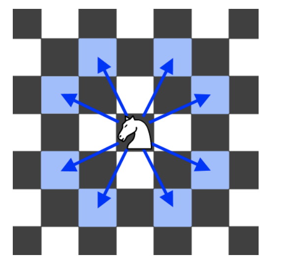

1197. Minimum Knight Moves
Medium

Share
In an infinite chess board with coordinates from -infinity to +infinity, you have a knight at square [0, 0].

A knight has 8 possible moves it can make, as illustrated below. Each move is two squares in a cardinal direction, then one square in an orthogonal direction.


Return the minimum number of steps needed to move the knight to the square [x, y]. It is guaranteed the answer exists.

 

Example 1:

Input: x = 2, y = 1
Output: 1
Explanation: [0, 0] → [2, 1]
Example 2:

Input: x = 5, y = 5
Output: 4
Explanation: [0, 0] → [2, 1] → [4, 2] → [3, 4] → [5, 5]
 

Constraints:

-300 <= x, y <= 300
0 <= |x| + |y| <= 300

### general solution:
``` python
class Solution:
    def minKnightMoves(self, x: int, y: int) -> int:
        if 0 == x and 0 == y:
            return 0
        
        myqueue = deque()
        myqueue.append((0,0))
        visitedsquares = set() 
        visitedsquares.add((0, 0))
        
        step_counter = 0
        while myqueue:
            currlevellength = len(myqueue)
            
            for _ in range(currlevellength):
                curr_location = myqueue.popleft()
                curr_x, curr_y = curr_location[0], curr_location[1]
                
                if self.handleEightDirections(curr_x, curr_y, x, y, myqueue, visitedsquares):
                    #print("hello")
                    return step_counter + 1 
                
            step_counter += 1
        
    def handleEightDirections(self, curr_x, curr_y, x, y, myqueue, visitedsquares):
        #print("handle")
        next_x, next_y = curr_x + 1, curr_y + 2
        if next_x == x and next_y == y:
            return True
        elif (next_x, next_y) not in visitedsquares:
            myqueue.append((next_x, next_y))
            visitedsquares.add((next_x, next_y))

        next_x, next_y = curr_x + 1, curr_y - 2
        if next_x == x and next_y == y:
            return True
        elif (next_x, next_y) not in visitedsquares:
            myqueue.append((next_x, next_y))
            visitedsquares.add((next_x, next_y))
            
        next_x, next_y = curr_x - 1, curr_y + 2
        if next_x == x and next_y == y:
            return True
        elif (next_x, next_y) not in visitedsquares:
            myqueue.append((next_x, next_y))
            visitedsquares.add((next_x, next_y))
            
        next_x, next_y = curr_x - 1, curr_y - 2
        if next_x == x and next_y == y:
            return True
        elif (next_x, next_y) not in visitedsquares:
            myqueue.append((next_x, next_y))
            visitedsquares.add((next_x, next_y))
            
        next_x, next_y = curr_x + 2, curr_y + 1
        if next_x == x and next_y == y:
            return True
        elif (next_x, next_y) not in visitedsquares:
            myqueue.append((next_x, next_y))
            visitedsquares.add((next_x, next_y))
            
        next_x, next_y = curr_x + 2, curr_y - 1
        if next_x == x and next_y == y:
            return True
        elif (next_x, next_y) not in visitedsquares:
            myqueue.append((next_x, next_y))
            visitedsquares.add((next_x, next_y))
           
        next_x, next_y = curr_x - 2, curr_y - 1
        if next_x == x and next_y == y:
            return True
        elif (next_x, next_y) not in visitedsquares:
            myqueue.append((next_x, next_y))
            visitedsquares.add((next_x, next_y))
            
        next_x, next_y = curr_x - 2, curr_y + 1
        if next_x == x and next_y == y:
            return True
        elif (next_x, next_y) not in visitedsquares:
            myqueue.append((next_x, next_y))
            visitedsquares.add((next_x, next_y))
        
        #print("end handle")
        return False
```
All test passed but just over time limit

### after pruning:

```python
class Solution:
    def minKnightMoves(self, x: int, y: int) -> int:
        if 0 == x and 0 == y:
            return 0
        
        myqueue = deque()
        myqueue.append((0,0))
        visitedsquares = dict() 
        visitedsquares[(0, 0)] = True
        
        step_counter = 0
        while myqueue:
            currlevellength = len(myqueue)
            
            for _ in range(currlevellength):
                curr_location = myqueue.popleft()
                curr_x, curr_y = curr_location[0], curr_location[1]
                
                if self.handleEightDirections(curr_x, curr_y, x, y, myqueue, visitedsquares):
                    #print("hello")
                    return step_counter + 1 
                
            step_counter += 1
        
    def handleEightDirections(self, curr_x, curr_y, x, y, myqueue, visitedsquares):
        #print("handle")
        next_x, next_y = curr_x + 1, curr_y + 2
        if next_x == x and next_y == y:
            return True
        elif (next_x, next_y) not in visitedsquares:
            myqueue.append((next_x, next_y))
            visitedsquares[(next_x, next_y)] = True

        next_x, next_y = curr_x + 1, curr_y - 2
        if next_x == x and next_y == y:
            return True
        elif (next_x, next_y) not in visitedsquares:
            myqueue.append((next_x, next_y))
            visitedsquares[(next_x, next_y)] = True
            
        next_x, next_y = curr_x - 1, curr_y + 2
        if next_x == x and next_y == y:
            return True
        elif (next_x, next_y) not in visitedsquares:
            myqueue.append((next_x, next_y))
            visitedsquares[(next_x, next_y)] = True
            
        next_x, next_y = curr_x - 1, curr_y - 2
        if next_x == x and next_y == y:
            return True
        elif (next_x, next_y) not in visitedsquares:
            myqueue.append((next_x, next_y))
            visitedsquares[(next_x, next_y)] = True
            
        next_x, next_y = curr_x + 2, curr_y + 1
        if next_x == x and next_y == y:
            return True
        elif (next_x, next_y) not in visitedsquares:
            myqueue.append((next_x, next_y))
            visitedsquares[(next_x, next_y)] = True
            
        next_x, next_y = curr_x + 2, curr_y - 1
        if next_x == x and next_y == y:
            return True
        elif (next_x, next_y) not in visitedsquares:
            myqueue.append((next_x, next_y))
            visitedsquares[(next_x, next_y)] = True
           
        next_x, next_y = curr_x - 2, curr_y - 1
        if next_x == x and next_y == y:
            return True
        elif (next_x, next_y) not in visitedsquares:
            myqueue.append((next_x, next_y))
            visitedsquares[(next_x, next_y)] = True
            
        next_x, next_y = curr_x - 2, curr_y + 1
        if next_x == x and next_y == y:
            return True
        elif (next_x, next_y) not in visitedsquares:
            myqueue.append((next_x, next_y))
            visitedsquares[(next_x, next_y)] = True
        
        #print("end handle")
        return False
```
### New method:

```py
class Solution:
    def minKnightMoves(self, x: int, y: int) -> int:
        if 0 == x and 0 == y:
            return 0
        
        myqueue = collections.deque([[0,0]])
        visited = set([(0,0)])
        step_counter = 0
        
        while myqueue:
            step_counter += 1 # one level needs adding one step
            curr_level_length = len(myqueue)
            for _ in range(curr_level_length):
                curr_node = myqueue.popleft()
                if self.checkIf8DirectionsContainTarget(curr_node, x, y, visited, myqueue):
                    return step_counter
        return step_counter
    
    def checkIf8DirectionsContainTarget(self, curr_node, x, y, visited, myqueue ):
        offsets = [(1,2),(-1,2),(2,1),(-2,1),(-1,-2),(1,-2),(-2,-1),(2,-1)]
        currx, curry = curr_node[0], curr_node[1]
        for offset in offsets:
            new_x = currx + offset[0]
            new_y = curry + offset[1]
            
            if new_x == x and new_y == y:
                return True
            elif (new_x, new_y) in visited:
                continue
            else:
                visited.add((new_x, new_y))
                myqueue.append([new_x, new_y])
                
        return False
```
### bi-bfs:

```py
class Solution:
    def minKnightMoves(self, x: int, y: int) -> int:
        if 0 == x and 0 == y:
            return 0
        
        forward_myqueue = collections.deque([[0,0]])
        backward_myqueue = collections.deque([[x,y]])
        forward_visited = set([(0,0)])
        backward_visited = set([(x,y)])
        
        step_counter = 0
        
        while forward_myqueue and backward_myqueue:
            # forward queue move forward one step
            step_counter += 1 # one level needs adding one step
            curr_level_length = len(forward_myqueue)
            for _ in range(curr_level_length):
                curr_node = forward_myqueue.popleft()
                if self.checkIf8DirectionsContainTarget(curr_node, forward_myqueue, forward_visited, backward_visited ):
                    return step_counter
                
            # backward queue move forward one step
            step_counter += 1 # one level needs adding one step
            curr_level_length = len(backward_myqueue)
            for _ in range(curr_level_length):
                curr_node = backward_myqueue.popleft()
                if self.checkIf8DirectionsContainTarget(curr_node, backward_myqueue, backward_visited, forward_visited ):
                    return step_counter
            
            
        return step_counter
    
    def checkIf8DirectionsContainTarget(self, curr_node, myqueue, visited, opposite_visited):
        offsets = [(1,2),(-1,2),(2,1),(-2,1),(-1,-2),(1,-2),(-2,-1),(2,-1)]
        currx, curry = curr_node[0], curr_node[1]
        for offset in offsets:
            new_x = currx + offset[0]
            new_y = curry + offset[1]
            
            if (new_x, new_y) in opposite_visited:
                return True
            elif (new_x, new_y) in visited:
                continue
            else:
                visited.add((new_x, new_y))
                myqueue.append([new_x, new_y])
                
        return False
```

```java
class Solution {
    public int minKnightMoves(int x, int y) {
        if (x == 0 && y == 0){
            return 0;
        }
        
        Deque<Coordinate> myqueue = new ArrayDeque<Coordinate>();
        HashMap<Coordinate, Integer> steps = new HashMap<Coordinate, Integer>();
        Coordinate startpoint = new Coordinate(0, 0);
        myqueue.add(startpoint);
        steps.put(startpoint, 0);
        
        while (!myqueue.isEmpty()){
            Coordinate currNode = myqueue.poll();
            int foundstep = handleEightDirections(x, y, currNode, myqueue, steps);
            if (foundstep >= 0){
                return foundstep;
            }
        }
        
        return -1;
        
    }
    
    private int handleEightDirections(int x, int y, Coordinate currnode, Deque<Coordinate> myqueue, HashMap<Coordinate, Integer> steps){
        int curr_x = currnode.x;
        int curr_y = currnode.y;
        int[][] offsets = {{1, 2}, {1, -2}, {-1, 2}, {-1, -2}, {2, 1}, {2, -1}, {-2, 1}, {-2, -1}};
        
        for (int i = 0; i < 8; i++){
            Coordinate next = new Coordinate(curr_x + offsets[i][0], curr_y + offsets[i][1]);
            if (curr_x + offsets[i][0] == x && curr_y + offsets[i][1] == y){ 
                return steps.get(currnode) + 1;
            }else if (steps.containsKey(next)){
                continue;
            }else{
                myqueue.add(next);
                steps.put(next, steps.get(currnode) + 1);
            }
        }
        return -1;
        
    }    
    
}
class Coordinate {
    public int x;
    public int y;
    
    public Coordinate(int x, int y){
        this.x = x;
        this.y = y;
    }
}
```