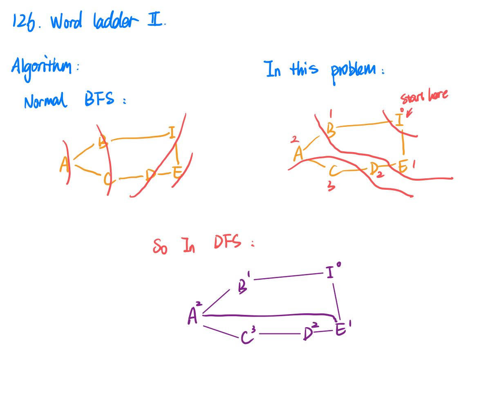

126. Word Ladder II
     
Hard

A transformation sequence from word beginWord to word endWord using a dictionary wordList is a sequence of words beginWord -> s1 -> s2 -> ... -> sk such that:

Every adjacent pair of words differs by a single letter.
Every si for 1 <= i <= k is in wordList. Note that beginWord does not need to be in wordList.
sk == endWord
Given two words, beginWord and endWord, and a dictionary wordList, return all the shortest transformation sequences from beginWord to endWord, or an empty list if no such sequence exists. Each sequence should be returned as a list of the words [beginWord, s1, s2, ..., sk].

 

Example 1:

Input: beginWord = "hit", endWord = "cog", wordList = ["hot","dot","dog","lot","log","cog"]
Output: [["hit","hot","dot","dog","cog"],["hit","hot","lot","log","cog"]]
Explanation: There are 2 shortest transformation sequences:
"hit" -> "hot" -> "dot" -> "dog" -> "cog"
"hit" -> "hot" -> "lot" -> "log" -> "cog"
Example 2:

Input: beginWord = "hit", endWord = "cog", wordList = ["hot","dot","dog","lot","log"]
Output: []
Explanation: The endWord "cog" is not in wordList, therefore there is no valid transformation sequence.
 

Constraints:

1 <= beginWord.length <= 5
endWord.length == beginWord.length
1 <= wordList.length <= 1000
wordList[i].length == beginWord.length
beginWord, endWord, and wordList[i] consist of lowercase English letters.
beginWord != endWord
All the words in wordList are unique.



```py
class Solution:
    def findLadders(self, beginWord: str, endWord: str, wordList: List[str]) -> List[List[str]]:
        if not wordList: # if wordSet is null 
            return 0
        if endWord not in wordList:
            return []
        wordList.append(beginWord)
        wordSet = set(wordList) 
        if beginWord == endWord: # special case
            return [beginWord]
        
        word2Disc = self.bfs(beginWord, endWord, wordSet)
        #print(word2Disc)
        
        results = []
        self.dfs(wordSet, beginWord, results, endWord, [beginWord], word2Disc)
        return results
    
    def dfs(self, wordSet, currWord, results, endWord, currPath, word2Disc):
        if currWord == endWord:
            results.append(list(currPath))
            return
        for nextWord in self.findNextWords(currWord, wordSet):
            if word2Disc[nextWord] == word2Disc[currWord] - 1:
                currPath.append(nextWord)
                self.dfs(wordSet, nextWord, results, endWord, currPath, word2Disc)
                currPath.remove(nextWord)

        
    def bfs(self, beginWord, endWord, wordSet):
        myqueue = collections.deque([endWord])
        word2Disc = dict({endWord: 0})
        while myqueue:
            currNode = myqueue.popleft()
            
            for nextWord in self.findNextWords(currNode, wordSet):
                if nextWord in word2Disc:
                    continue
                word2Disc[nextWord] =  word2Disc[currNode] + 1
                myqueue.append(nextWord)
        return word2Disc
                
                
    def findNextWords(self, currWord, wordSet ):
        allNextWords = []
        for i in range(len(currWord)):
            leftPart, rightPart = currWord[:i], currWord[i + 1:]
        
            for char in "abcdefghijklmnopqrstuvwxyz":
                newWord = leftPart + char + rightPart
                if newWord == currWord:
                    continue
                if newWord not in wordSet:
                    continue
                allNextWords.append(newWord)
       # print("allNextWords: ", currWord, allNextWords)
        return allNextWords
```