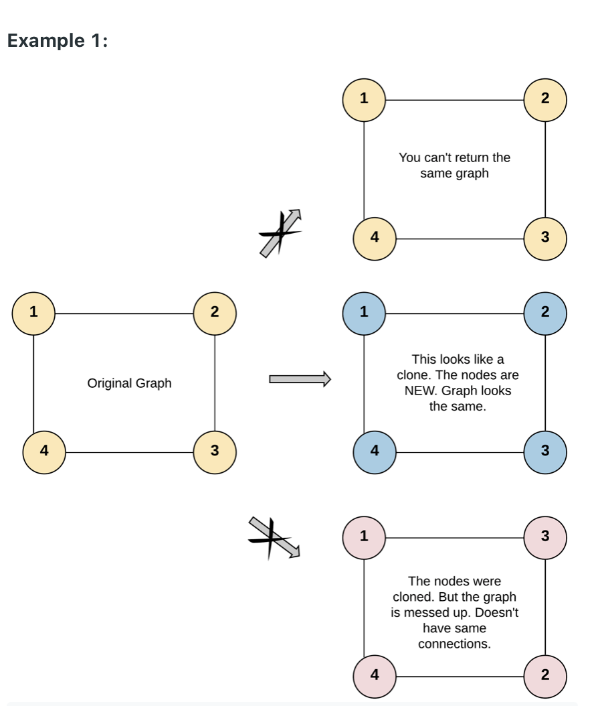
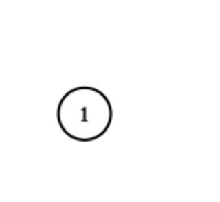

133. Clone Graph
    
Medium

Given a reference of a node in a connected undirected graph.

Return a deep copy (clone) of the graph.

Each node in the graph contains a value (int) and a list (List[Node]) of its neighbors.

class Node {
    public int val;
    public List<Node> neighbors;
}
 

Test case format:

For simplicity, each node's value is the same as the node's index (1-indexed). For example, the first node with val == 1, the second node with val == 2, and so on. The graph is represented in the test case using an adjacency list.

An adjacency list is a collection of unordered lists used to represent a finite graph. Each list describes the set of neighbors of a node in the graph.

The given node will always be the first node with val = 1. You must return the copy of the given node as a reference to the cloned graph.


Input: adjList = [[2,4],[1,3],[2,4],[1,3]]
Output: [[2,4],[1,3],[2,4],[1,3]]

Explanation: There are 4 nodes in the graph.

1st node (val = 1)'s neighbors are 2nd node (val = 2) and 4th node (val = 4).

2nd node (val = 2)'s neighbors are 1st node (val = 1) and 3rd node (val = 3).

3rd node (val = 3)'s neighbors are 2nd node (val = 2) and 4th node (val = 4).

4th node (val = 4)'s neighbors are 1st node (val = 1) and 3rd node (val = 3).

Example 2:



Input: adjList = [[]]
Output: [[]]
Explanation: Note that the input contains one empty list. The graph consists of only one node with val = 1 and it does not have any neighbors.
Example 3:

Input: adjList = []
Output: []
Explanation: This an empty graph, it does not have any nodes.
 

Constraints:

The number of nodes in the graph is in the range [0, 100].
1 <= Node.val <= 100
Node.val is unique for each node.
There are no repeated edges and no self-loops in the graph.
The Graph is connected and all nodes can be visited starting from the given node.

```python
"""
# Definition for a Node.
class Node:
    def __init__(self, val = 0, neighbors = None):
        self.val = val
        self.neighbors = neighbors if neighbors is not None else []
"""

"""
# Definition for a Node.
class Node:
    def __init__(self, val = 0, neighbors = None):
        self.val = val
        self.neighbors = neighbors if neighbors is not None else []
"""
class Solution:
    def cloneGraph(self, node: 'Node') -> 'Node':
        if not node:
            return None
        
        # 1 copy all nodes (== set ".val" value for all nodes)
        # 1.1 we have only one node. We need to get all nodes 
        allOldNodes = self.getAllNodes(node)  
        # 1.2 for each node, copy it
        old2newNodeMap = {}
        for oneOldNode in allOldNodes:
            # 1.3 map oldnode to newnode
            old2newNodeMap[oneOldNode] = Node(val=oneOldNode.val) # copy one node
            ## ==
            #   val = oneOldNode.val
            #   old2newNodeMap[oneOldNode] = Node(val)
        
        # 2 copy all edges (== set ".neighbors" value for all nodes)
        for oneOldNode in allOldNodes: # travel all visited node 
            newNode = old2newNodeMap[oneOldNode] # value ?
            for oldNodeNeighbor in oneOldNode.neighbors: #traval all neighbors
                newNodeNeighbor = old2newNodeMap[oldNodeNeighbor] #copy values
                newNode.neighbors.append(newNodeNeighbor) #add neighbors to newNode
                
        return old2newNodeMap[node] 
                
        
    def getAllNodes(self, rootnode):
        allOldNodes = set([rootnode]) # record all visited nodes (a set())
        queue = collections.deque([rootnode]) # create a queue to do bfs
        while queue: # bfs template starts
            currnode = queue.popleft() # pop and store first element in queue
            for neighbor in currnode.neighbors: # travel all neighbours for current node
                if neighbor not in allOldNodes: # if this neighbor not visited
                    queue.append(neighbor) # add neighbors in queue mark as visited
                    allOldNodes.add(neighbor)
        return allOldNodes
                
```
