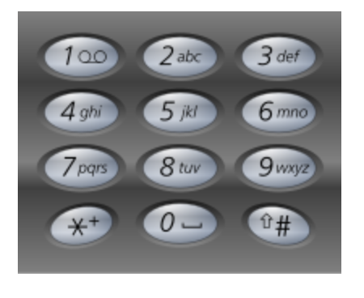

17. Letter Combinations of a Phone Number
    
Medium

Given a string containing digits from 2-9 inclusive, return all possible letter combinations that the number could represent. Return the answer in any order.

A mapping of digit to letters (just like on the telephone buttons) is given below. Note that 1 does not map to any letters.


Example 1:

Input: digits = "23"
Output: ["ad","ae","af","bd","be","bf","cd","ce","cf"]
Example 2:

Input: digits = ""
Output: []
Example 3:

Input: digits = "2"
Output: ["a","b","c"]
 

Constraints:

0 <= digits.length <= 4
digits[i] is a digit in the range ['2', '9'].

```py
# const.py
NUMBER2LETTERS = {
    "2": "abc",
    "3": "def",
    "4": "ghi",
    "5": "jkl",
    "6": "mno",
    "7": "pqrs",
    "8": "tuv",
    "9": "wxyz",
}

class Solution:
    def letterCombinations(self, digits: str) -> List[str]:
        if not digits:
            return []
        
        results = []
        self.dfs(digits, results, [], 0)
        return results
    
    def dfs(self, digits, results, currRes, currIndex):
        if len(currRes) == len(digits):
            results.append("".join(currRes))
            return
        
        for letter in NUMBER2LETTERS[digits[currIndex]]:
            currRes.append(letter)
            self.dfs(digits, results, currRes, currIndex + 1)
            currRes.pop()
```

```java
class Solution {
    private String[] NUMBER2LETTER = {
        "",
        "",
        "abc",
        "def",
        "ghi",
        "jkl",
        "mno",
        "pqrs",
        "tuv",
        "wxyz"
    };
    
    public List<String> letterCombinations(String digits) {
        if (digits.length() == 0){
            return new ArrayList<String>();
        }
        
        List<String> results = new ArrayList<String>();
        this.dfs(digits, results, "", 0);
        return results;
    }
    
    private void dfs(String digits, List<String> results, 
                     String currRes, int currIndex){
        if (currRes.length() == digits.length()){
            results.add(currRes);
            return ;
        }
        
        int digit = digits.charAt(currIndex) - '0';
        for (int i = 0; i < NUMBER2LETTER[digit].length(); i++){
            this.dfs(digits, results, 
                     currRes + NUMBER2LETTER[digit].charAt(i), currIndex + 1);
        }
    }
}
```