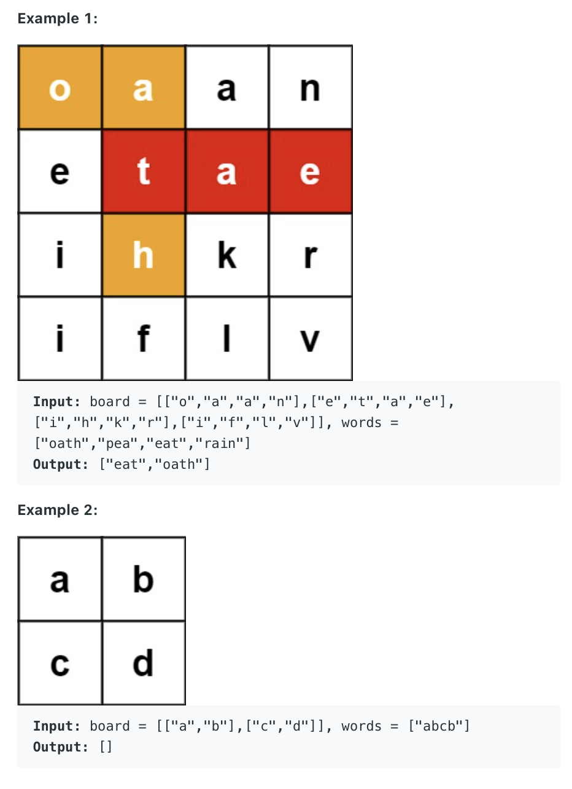

212. Word Search II
     
Hard

Given an m x n board of characters and a list of strings words, return all words on the board.

Each word must be constructed from letters of sequentially adjacent cells, where adjacent cells are horizontally or vertically neighboring. The same letter cell may not be used more than once in a word.



Constraints:

m == board.length
n == board[i].length
1 <= m, n <= 12
board[i][j] is a lowercase English letter.
1 <= words.length <= 3 * 104
1 <= words[i].length <= 10
words[i] consists of lowercase English letters.
All the strings of words are unique.

```py

offsets = [(0,1),(1,0),(0,-1),(-1,0)]
class Solution:
    def findWords(self, board: List[List[str]], words: List[str]) -> List[str]:
        if not board or not words:
            return []
        
        rleng = len(board)
        coleng = len(board[0])
        visited = [[False] * coleng for _ in range(rleng)]
        
        prefixDictIsTarget = self.buildPrefixDict(words)
        results = set()
        for i in range(rleng):
            for j in range(coleng):
                if board[i][j] in prefixDictIsTarget:
                    visited[i][j] = True
                    self.dfs(board, i, j, board[i][j], visited, prefixDictIsTarget, results, rleng, coleng)
                    visited[i][j] = False
        return list(results)
    
    def buildPrefixDict(self, words):
        prefixDictIsTarget = dict()
        for word in words:
            for i in range(len(word)): 
                prefix = word[:i + 1]
                if prefix not in prefixDictIsTarget:
                    prefixDictIsTarget[prefix] = False
            prefixDictIsTarget[word] = True
        return prefixDictIsTarget
           
    def dfs(self, board, x, y, currRes, visited, prefixDictIsTarget, results, rleng, coleng):
        if currRes in prefixDictIsTarget:
            if prefixDictIsTarget[currRes]:
                results.add(currRes)

            for offset in offsets:
                newx = x + offset[0] 
                newy = y + offset[1]

                if not (0 <= newx < rleng and 0 <= newy < coleng):
                    continue
                if visited[newx][newy]:
                    continue

                visited[newx][newy] = True
                self.dfs(board, newx, newy, currRes + board[newx][newy], visited, prefixDictIsTarget, results, rleng, coleng)
                visited[newx][newy] = False
```

