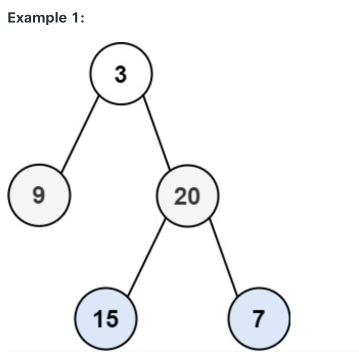

232. Implement Queue using Stacks
     
Easy

Implement a first in first out (FIFO) queue using only two stacks. The implemented queue should support all the functions of a normal queue (push, peek, pop, and empty).

Implement the MyQueue class:

void push(int x) Pushes element x to the back of the queue.
int pop() Removes the element from the front of the queue and returns it.
int peek() Returns the element at the front of the queue.
boolean empty() Returns true if the queue is empty, false otherwise.
Notes:

You must use only standard operations of a stack, which means only push to top, peek/pop from top, size, and is empty operations are valid.
Depending on your language, the stack may not be supported natively. You may simulate a stack using a list or deque (double-ended queue) as long as you use only a stack's standard operations.
 

Example 1:

Input
["MyQueue", "push", "push", "peek", "pop", "empty"]
[[], [1], [2], [], [], []]
Output
[null, null, null, 1, 1, false]

Explanation
MyQueue myQueue = new MyQueue();
myQueue.push(1); // queue is: [1]
myQueue.push(2); // queue is: [1, 2] (leftmost is front of the queue)
myQueue.peek(); // return 1
myQueue.pop(); // return 1, queue is [2]
myQueue.empty(); // return false
 

Constraints:

1 <= x <= 9
At most 100 calls will be made to push, pop, peek, and empty.
All the calls to pop and peek are valid.
 

Follow-up: Can you implement the queue such that each operation is amortized O(1) time complexity? In other words, performing n operations will take overall O(n) time even if one of those operations may take longer.

### Using array:
```java
class MyQueue {
    private int tail;
    private int head;
    private int maxSize;
    private int[] elements;
    
    public MyQueue() {
        this.head = -1;
        this.tail = -1;
        this.maxSize = 20;
        this.elements = new int[this.maxSize]; 
    }
    
    public void push(int x) {
        if (this.head == -1 && this.tail == -1){
            this.elements[0] = x;
            this.head = 0;
            this.tail = 0;
            return;
        }else{
            if ((this.tail + 2) % this.maxSize == this.head){
                System.out.println("error: full");
                return;
            }
            this.tail ++;
            this.tail = this.tail % this.maxSize;
            this.elements[this.tail] = x;
            return;
        }
    }
    
    public int pop() {
        int value = this.elements[this.head];
        this.head ++;
        this.head = this.head % this.maxSize;
        return value;
    }
    
    public int peek() {
        return this.elements[this.head];
    }
    
    public boolean empty() {
        if ((this.head == -1 && this.tail == -1) || this.head == this.tail + 1){
            return true;
        }
        return false;
    }
}

/**
 * Your MyQueue object will be instantiated and called as such:
 * MyQueue obj = new MyQueue();
 * obj.push(x);
 * int param_2 = obj.pop();
 * int param_3 = obj.peek();
 * boolean param_4 = obj.empty();
 */
 ```

 ### Using LinkedList:
 ```java
 class Node{
    public int value;
    public Node next;
}

class MyQueue {
    private Node head;
    private Node tail;
    
    public MyQueue() {
        this.tail = null;
        this.head = null;
    }
    
    public void push(int x) {
        if (this.head == null && this.tail == null){
            this.head = new Node();
            this.head.value = x;
            this.head.next = null;
            this.tail = this.head;
            return;
        }
        Node newtail = new Node();
        newtail.value = x;
        this.tail.next = newtail;
        this.tail = newtail;
        return;
    }
    
    public int pop() {
        int value = this.head.value;
        if (this.head == this.tail){
            this.tail = null;
        }
        this.head = this.head.next;
        return value;
    }
    
    public int peek() {
        return this.head.value;
    }
    
    public boolean empty() {
        if (this.head == null && this.tail == null){
            return true;
        }
        return false;
    }
}

/**
 * Your MyQueue object will be instantiated and called as such:
 * MyQueue obj = new MyQueue();
 * obj.push(x);
 * int param_2 = obj.pop();
 * int param_3 = obj.peek();
 * boolean param_4 = obj.empty();
 */
```

### Implement Circular Queue Using array:
```java
class MyQueue {
    private int tail;
    private int head;
    private int maxSize;
    private int[] elements;
    
    public MyQueue() {
        this.head = -1;
        this.tail = -1;
        this.maxSize = 20;
        this.elements = new int[this.maxSize]; 
    }
    
    public void push(int x) {
        if (this.head == -1 && this.tail == -1){
            this.elements[0] = x;
            this.head = 0;
            this.tail = 0;
            return;
        }else{
            if ((this.tail + 2) % this.maxSize == this.head){
                System.out.println("error: full");
                return;
            }
            this.tail ++;
            this.tail = this.tail % this.maxSize;
            this.elements[this.tail] = x;
            return;
        }
    }
    
    public int pop() {
        int value = this.elements[this.head];
        this.head ++;
        this.head = this.head % this.maxSize;
        return value;
    }
    
    public int peek() {
        return this.elements[this.head];
    }
    
    public boolean empty() {
        if ((this.head == -1 && this.tail == -1) || this.head == this.tail + 1){
            return true;
        }
        return false;
    }
}

/**
 * Your MyQueue object will be instantiated and called as such:
 * MyQueue obj = new MyQueue();
 * obj.push(x);
 * int param_2 = obj.pop();
 * int param_3 = obj.peek();
 * boolean param_4 = obj.empty();
 */
```


### Using stack implement queue:
```java
import java.util.Stack;

class MyQueue {
    Stack<Integer> stackFirst;
    Stack<Integer> stackSecond;
    public MyQueue() {
        this.stackFirst = new Stack<Integer>(); // head element is at the bottom
        this.stackSecond = new Stack<Integer>(); // tail element is at the bottom
    }
    
    public void push(int x) {
        if (this.stackFirst.empty()){
            if (this.stackSecond.empty()){
                this.stackFirst.push(x);
                return;
            }else if (!this.stackSecond.empty()){
                while(!this.stackSecond.empty()){
                    int popElement = this.stackSecond.pop();
                    this.stackFirst.push(popElement);
                }
                this.stackFirst.push(x);
                return;
            }
        }else{
            if (this.stackSecond.empty()){
                this.stackFirst.push(x);
                return;
            }
        }
    }
    
    public int pop() {
        if (this.stackFirst.empty()){
            if (this.stackSecond.empty()){
                return -1;
            }else if (!this.stackSecond.empty()){
                return this.stackSecond.pop();
            }
        }
        if (this.stackSecond.empty()){
            while(!this.stackFirst.empty()){
                int popElement = this.stackFirst.pop();
                this.stackSecond.push(popElement);
            }
            return this.stackSecond.pop();
        }
        return -1;
    }
    
    public int peek() {
        if (this.stackFirst.empty()){
            if (this.stackSecond.empty()){
                return -1;
            }else if (!this.stackSecond.empty()){
                return this.stackSecond.peek();
            }
        }
        if (this.stackSecond.empty()){
            while(!this.stackFirst.empty()){
                int popElement = this.stackFirst.pop();
                this.stackSecond.push(popElement);
            }
            return this.stackSecond.peek();
        }
        return -1;
    }
    
    public boolean empty() {
        if (this.stackFirst.empty() && this.stackSecond.empty()){
            return true;
        }
        return false;
    }
}

/**
 * Your MyQueue object will be instantiated and called as such:
 * MyQueue obj = new MyQueue();
 * obj.push(x);
 * int param_2 = obj.pop();
 * int param_3 = obj.peek();
 * boolean param_4 = obj.empty();
 */
 ```

 ### Using Deque implement queue:
 ```java
 from collections import deque

class MyQueue:

    def __init__(self):
        self.myqueue = deque() # left is head

    def push(self, x: int) -> None:
        self.myqueue.append(x)

    def pop(self) -> int:
        return self.myqueue.popleft();

    def peek(self) -> int:
        if self.myqueue[0]:
            return self.myqueue[0]
        return -1

    def empty(self) -> bool:
        return len(self.myqueue) == 0
```

