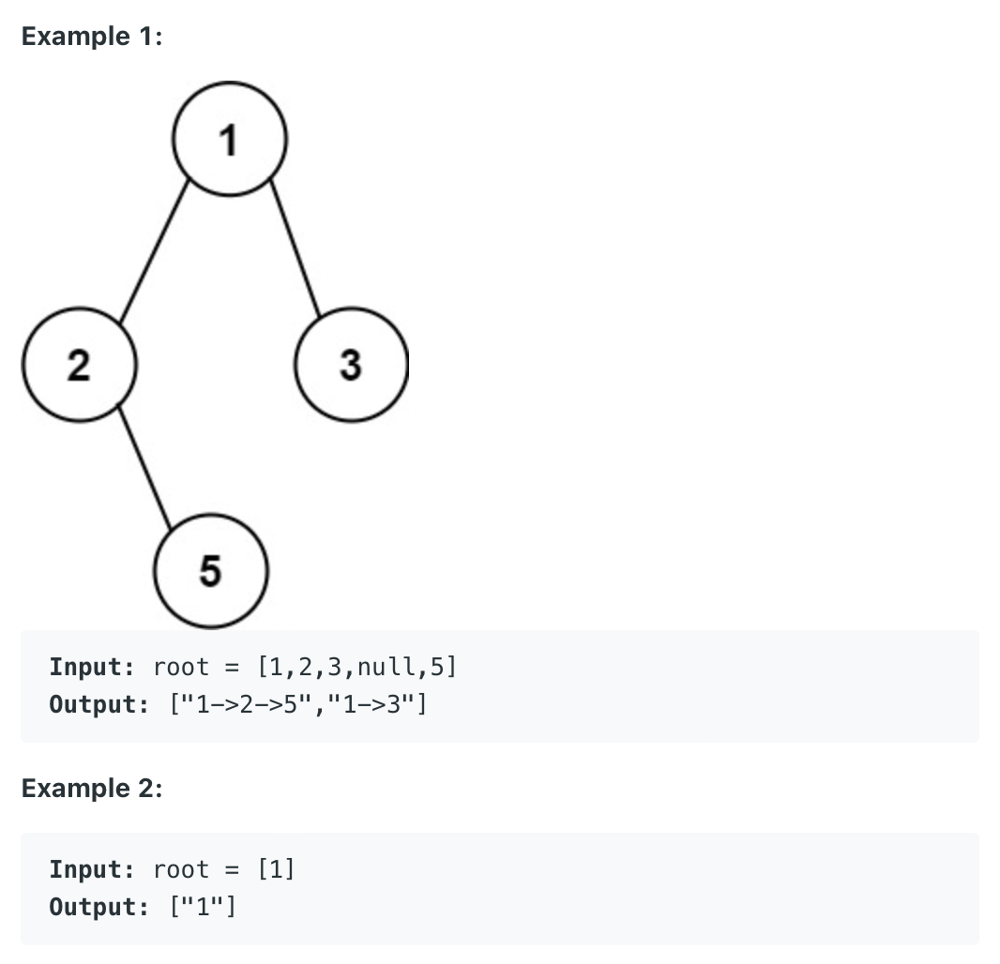

Given the root of a binary tree, return all root-to-leaf paths in any order.

A leaf is a node with no children.


Constraints:

The number of nodes in the tree is in the range [1, 100].
-100 <= Node.val <= 100

```py
# Definition for a binary tree node.
# class TreeNode:
#     def __init__(self, val=0, left=None, right=None):
#         self.val = val
#         self.left = left
#         self.right = right
class Solution:
    def binaryTreePaths(self, root: Optional[TreeNode]) -> List[str]:
        if not root:
            return []
        
        paths = []
        
        self.dfs(root, [root], paths)
        return paths
    
    def dfs(self, curr_node, path, paths):
        if not curr_node.right and not curr_node.left:
            # paths.append(self.listToString(path))
            paths.append("->".join([str(node.val) for node in path]))
            return
        
        if curr_node.left:
            path.append(curr_node.left)
            self.dfs(curr_node.left, path, paths)
            path.pop()
            
        if curr_node.right:
            path.append(curr_node.right)
            self.dfs(curr_node.right, path, paths)
            path.pop()
            

    def listToString(self, path):
        string = ""
        
        for node in path[0:-1]:
            string += str(node.val) + "->" 
        
        string += str(path[-1].val)
        return string
```
        