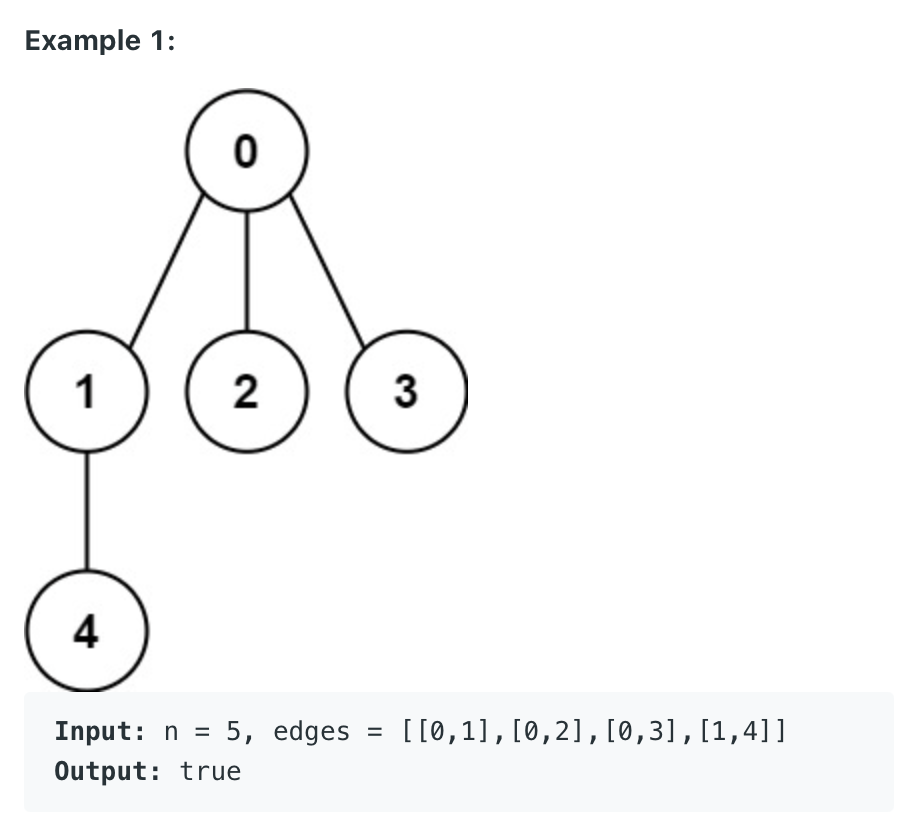
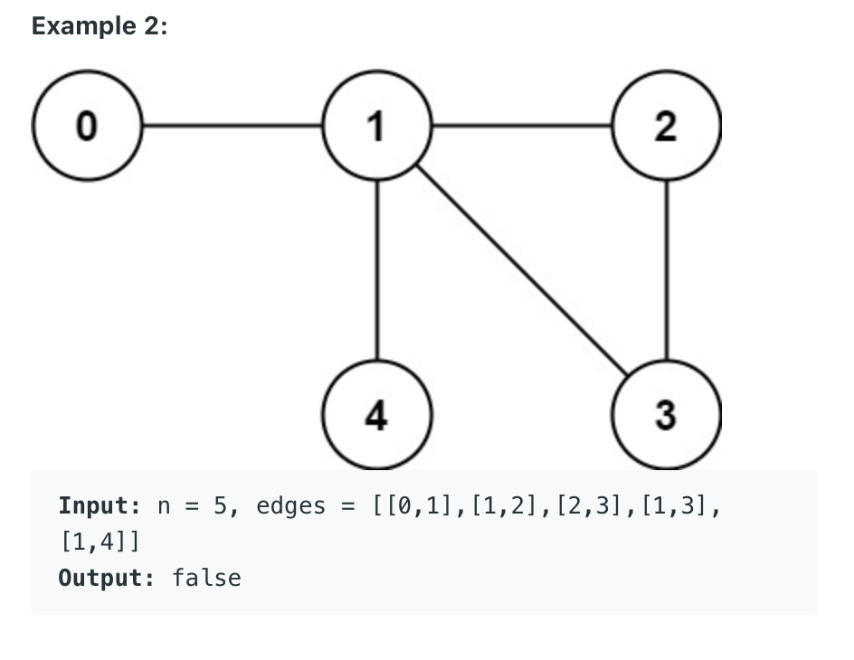

261. Graph Valid Tree

You have a graph of n nodes labeled from 0 to n - 1. You are given an integer n and a list of edges where edges[i] = [ai, bi] indicates that there is an undirected edge between nodes ai and bi in the graph.

Return true if the edges of the given graph make up a valid tree, and false otherwise.



Constraints:

1 <= n <= 2000
0 <= edges.length <= 5000
edges[i].length == 2
0 <= ai, bi < n
ai != bi
There are no self-loops or repeated edges.

```py
class Solution:
    def validTree(self, n: int, edges: List[List[int]]) -> bool:
        if not edges:
            if n <= 1:
                return True
            return False
            
        node2neighbors = dict()
        for edge in edges:
            for node in edge:
                node2neighbors[node] = []
        
        for edge in edges:
            node2neighbors[edge[0]].append(edge[1])
            node2neighbors[edge[1]].append(edge[0])
            
        myqueue = collections.deque()
        startnode = edges[0][0]
        
        myqueue.append(startnode)
        visited = set()
        visited.add(startnode)
        while myqueue:
            print(myqueue)
            currNode = myqueue.popleft()
            for neignbor in node2neighbors[currNode]:
                if neignbor not in visited:
                    myqueue.append(neignbor)
                    visited.add(neignbor)
                
        if len(visited) == n:
            if len(edges) <= n -1:
                return True
        return False
```