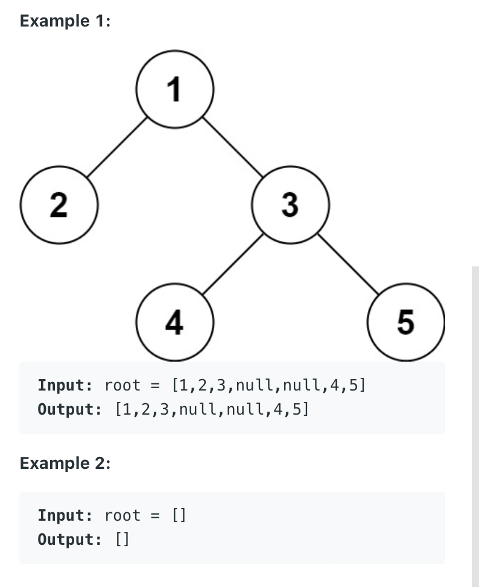

297. Serialize and Deserialize Binary Tree
     
Hard

Serialization is the process of converting a data structure or object into a sequence of bits so that it can be stored in a file or memory buffer, or transmitted across a network connection link to be reconstructed later in the same or another computer environment.

Design an algorithm to serialize and deserialize a binary tree. There is no restriction on how your serialization/deserialization algorithm should work. You just need to ensure that a binary tree can be serialized to a string and this string can be deserialized to the original tree structure.

Clarification: The input/output format is the same as how LeetCode serializes a binary tree. You do not necessarily need to follow this format, so please be creative and come up with different approaches yourself.



Constraints:

- The number of nodes in the tree is in the range [0, 104].
- 1000 <= Node.val <= 1000

```py
# Definition for a binary tree node.
# class TreeNode(object):
#     def __init__(self, x):
#         self.val = x
#         self.left = None
#         self.right = None

class Codec:

    def serialize(self, root):
        """Encodes a tree to a single string.
        
        :type root: TreeNode
        :rtype: str "[elem1,elem2,elem3]"
        """
        if not root:
            return "[]"
        
        myqueue = collections.deque([root])
        all_nodes_values = [root.val]
        while myqueue:
            currNode = myqueue.popleft()
            if currNode.left:
                myqueue.append(currNode.left)
                all_nodes_values.append(currNode.left.val)
            else:
                all_nodes_values.append("null")
                
            if currNode.right:
                myqueue.append(currNode.right)
                all_nodes_values.append(currNode.right.val)      
            else:
                all_nodes_values.append("null")
                
        # print(all_nodes_values)   
        # clean last useless elemetns "null"
        last_index = 0
        for i in range(len(all_nodes_values) -1, -1, -1) : 
            if all_nodes_values[i] == "null":
                if all_nodes_values[i - 1] == "null":
                    continue
                else:
                    last_index = i - 1
                    break
        all_nodes_values = all_nodes_values[:last_index+1]
        # print(all_nodes_values) 
        
        # convert list to str
        result_str = "["
        result_str += ",".join(str(x) for x in all_nodes_values)
        result_str += "]"
        print(result_str)
        return result_str
    
    def deserialize(self, data):
        """Decodes your encoded data to tree.
        
        :type data: str
        :rtype: TreeNode
        """
        if data == "[]":
            return None
        
        data = data[1:-1] 
        data_list = data.split(",")
        # print(data_list)
        
        root = self.buildTreeNode(data_list[0])
        
        if len(data_list) > 1:
            queue = collections.deque([root])
            index = 1
            while queue:
                currNode = queue.popleft()

                currNode.left = self.buildTreeNode(data_list[index])
                if data_list[index] != "null": # if currNode.left is not None:
                    queue.append(currNode.left)
                index += 1
                if index == len(data_list):
                    break

                currNode.right = self.buildTreeNode(data_list[index])
                if currNode.right is not None: # if data_list[index] != "null":
                    queue.append(currNode.right)
                index += 1
                if index == len(data_list):
                    break
        # print(root)
        return root
        
        
    def buildTreeNode(self, val):
        if val == "null":
            return None
        else:
            return TreeNode(val)
        
        
        

# Your Codec object will be instantiated and called as such:
# ser = Codec()
# deser = Codec()
# ans = deser.deserialize(ser.serialize(root))
```

