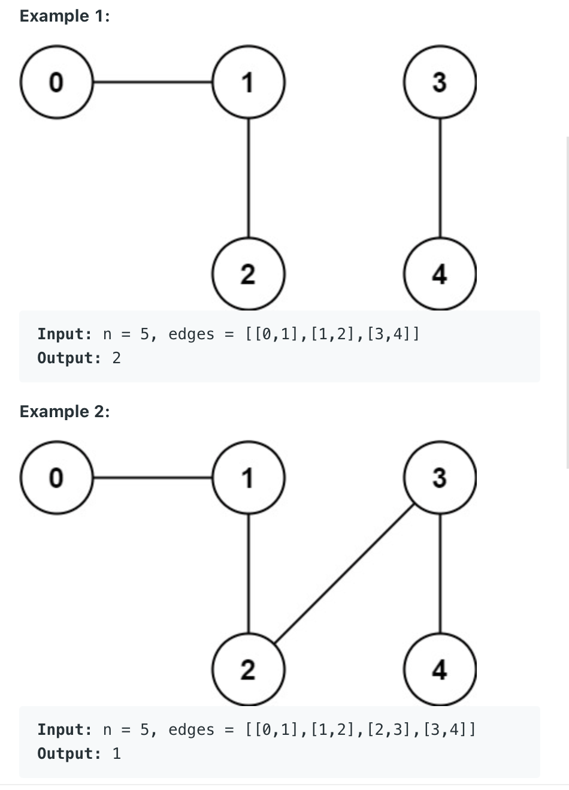

323. Number of Connected Components in an Undirected 
     Graph
     
Medium

You have a graph of n nodes. You are given an integer n and an array edges where edges[i] = [ai, bi] indicates that there is an edge between ai and bi in the graph.

Return the number of connected components in the graph.



Constraints:

1 <= n <= 2000
1 <= edges.length <= 5000
edges[i].length == 2
0 <= ai <= bi < n
ai != bi
There are no repeated edges.

```py
class Solution:
    def countComponents(self, n: int, edges: List[List[int]]) -> int:
        if not edges:
            return n
        
        node2Neighbors = dict()
        for edge in edges:
            for node in edge:
                node2Neighbors[node] = []
        
        for edge in edges:
            node2Neighbors[edge[0]].append(edge[1])
            node2Neighbors[edge[1]].append(edge[0])
    
        visited = set()
        connectedComponentsCounter = 0
        for node in node2Neighbors:
            if node not in visited:
                self.bfs(node, visited, node2Neighbors)
                connectedComponentsCounter += 1
        if len(visited) < n:
            return n - len(visited) + connectedComponentsCounter
        return connectedComponentsCounter
    
    def bfs(self, root, visited, node2Neighbors):
        myqueue = collections.deque()
        myqueue.append(root)
        visited.add(root)
        while myqueue:
            currNode = myqueue.popleft()
            for neighbor in node2Neighbors[currNode]:
                if neighbor not in visited:
                    myqueue.append(neighbor)
                    visited.add(neighbor)
```

                
                
            
            
            
                
                
                
            
                
        