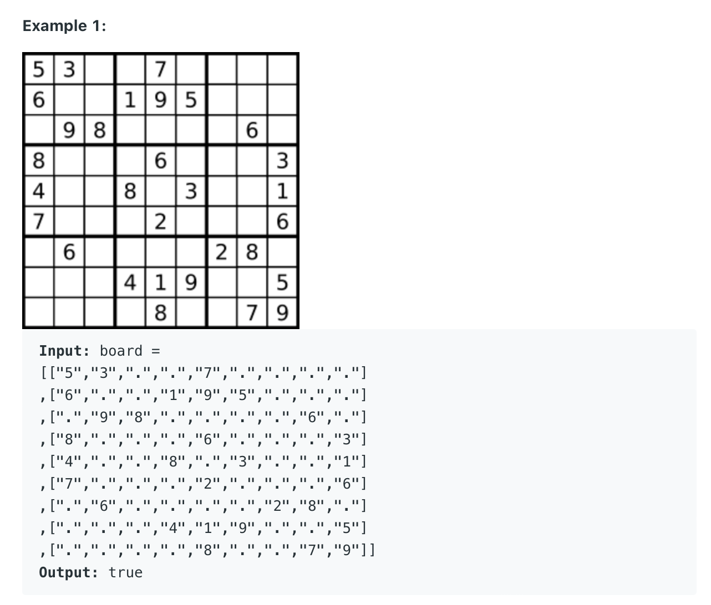

36. Valid Sudoku
    
Medium

Determine if a 9 x 9 Sudoku board is valid. Only the filled cells need to be validated according to the following rules:

Each row must contain the digits 1-9 without repetition.
Each column must contain the digits 1-9 without repetition.
Each of the nine 3 x 3 sub-boxes of the grid must contain the digits 1-9 without repetition.
Note:

A Sudoku board (partially filled) could be valid but is not necessarily solvable.
Only the filled cells need to be validated according to the mentioned rules.



Example 2:

Input: board = 
[["8","3",".",".","7",".",".",".","."]
,["6",".",".","1","9","5",".",".","."]
,[".","9","8",".",".",".",".","6","."]
,["8",".",".",".","6",".",".",".","3"]
,["4",".",".","8",".","3",".",".","1"]
,["7",".",".",".","2",".",".",".","6"]
,[".","6",".",".",".",".","2","8","."]
,[".",".",".","4","1","9",".",".","5"]
,[".",".",".",".","8",".",".","7","9"]]
Output: false
Explanation: Same as Example 1, except with the 5 in the top left corner being modified to 8. Since there are two 8's in the top left 3x3 sub-box, it is invalid.

Constraints:

board.length == 9
board[i].length == 9
board[i][j] is a digit 1-9 or '.'.

```py

class Solution:
    def isValidSudoku(self, board: List[List[str]]) -> bool:
        if not board:
            return False
         
        for row in board:
            visited = set()
            for number in row:
                if not self.isValid(number, visited):
                    return False
                
        for i in range(9):
            visited = set()
            for j in range(9):
                number = board[j][i]
                if not self.isValid(number, visited):
                    return False
                
        # 00, 01, 02, 10, 11, 12, 20, 21, 22
        for k in range(3):
            for l in range(3):
                visited = set()
                for rowi in range(l*3, l*3+3):
                    for colj in range(k*3, k*3+3):
                        if  not self.isValid(board[rowi][colj], visited):
                            return False
        return True
                   
        # 03, 04, 05, 13, 14, 15, 23, 24, 25
        # 06, 07, 08, 16, 17, 18, 26, 27, 28
        # 30 ,31, 32, 40,...
                
    
    def isValid(self, number, visited):
        if number == ".":
            return True
        if number in visited:
            return False
        visited.add(number)
        return True
```