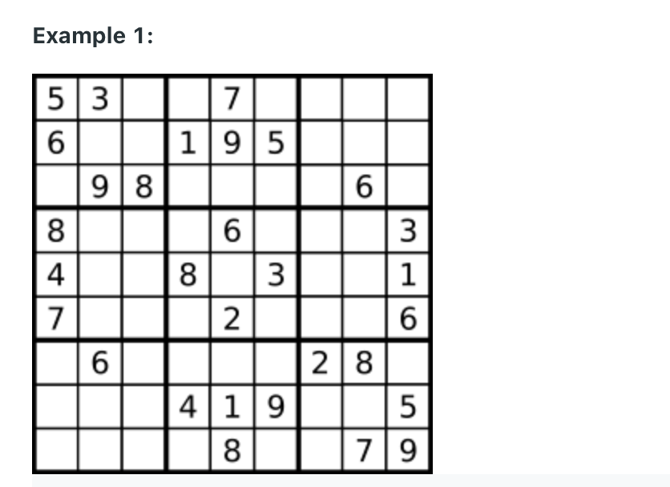
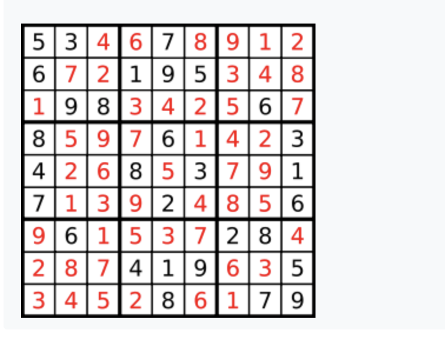

37. Sudoku Solver
    
Hard

Write a program to solve a Sudoku puzzle by filling the empty cells.

A sudoku solution must satisfy all of the following rules:

Each of the digits 1-9 must occur exactly once in each row.
Each of the digits 1-9 must occur exactly once in each column.
Each of the digits 1-9 must occur exactly once in each of the 9 3x3 sub-boxes of the grid.
The '.' character indicates empty cells.


```py
Input: board = 
[["5","3",".",".","7",".",".",".","."],
["6",".",".","1","9","5",".",".","."],
[".","9","8",".",".",".",".","6","."],
["8",".",".",".","6",".",".",".","3"],
["4",".",".","8",".","3",".",".","1"],
["7",".",".",".","2",".",".",".","6"],
[".","6",".",".",".",".","2","8","."],
[".",".",".","4","1","9",".",".","5"],
[".",".",".",".","8",".",".","7","9"]]
```
```py
Output: 
[["5","3","4","6","7","8","9","1","2"],
["6","7","2","1","9","5","3","4","8"],
["1","9","8","3","4","2","5","6","7"],
["8","5","9","7","6","1","4","2","3"],
["4","2","6","8","5","3","7","9","1"],
["7","1","3","9","2","4","8","5","6"],
["9","6","1","5","3","7","2","8","4"],
["2","8","7","4","1","9","6","3","5"],
["3","4","5","2","8","6","1","7","9"]]
Explanation: The input board is shown above and the only valid solution is shown below:
```


## Solution 1: (This verision needs improve on Runtime)

```py
class Solution:
    def solveSudoku(self, board: List[List[str]]) -> None:
        """
        Do not return anything, modify board in-place instead.
        """
        if not board:
            return 
       
        if self.dfs(board, 0, 0):
            return board
    
    def dfs(self, board, rowi, colj) -> bool:
        if self.isNoEmpty(board): 
            if self.isValidSudoku(board):
                return True
            else:
                return False
        
        if colj == 9:
            rowi += 1
            colj = 0
        if rowi == 9 and colj == 0:
            if self.isNoEmpty(board) and self.isValidSudoku(board):
                return True
            else:
                return False
        
        if board[rowi][colj] != ".":
            return self.dfs(board, rowi, colj+1)
        for input_num in range(1, 10):
            if not self.isValidSudoku(board):
                continue
            board[rowi][colj] = str(input_num) 
            if self.dfs(board, rowi, colj+1):
                return True
            board[rowi][colj] = "." 
        return False
            
            
    def isNoEmpty(self, board):
        for i in range(9):
            for j in range(9):
                if board[i][j] == ".":
                    return False
        return True
    
   
    
    def isValidSudoku(self, board: List[List[str]]) -> bool:
        if not board:
            return False
         
        for row in board:
            visited = set()
            for number in row:
                if not self.isValid(number, visited):
                    return False
                
        for i in range(9):
            visited = set()
            for j in range(9):
                number = board[j][i]
                if not self.isValid(number, visited):
                    return False
                
        # 00, 01, 02, 10, 11, 12, 20, 21, 22
        for k in range(3):
            for l in range(3):
                visited = set()
                for rowi in range(l*3, l*3+3):
                    for colj in range(k*3, k*3+3):
                        if  not self.isValid(board[rowi][colj], visited):
                            return False
        return True
                   
        # 03, 04, 05, 13, 14, 15, 23, 24, 25
        # 06, 07, 08, 16, 17, 18, 26, 27, 28
        # 30 ,31, 32, 40,...
                
    
    def isValid(self, number, visited):
        if number == ".":
            return True
        if number in visited:
            return False
        visited.add(number)
        return True
        
```