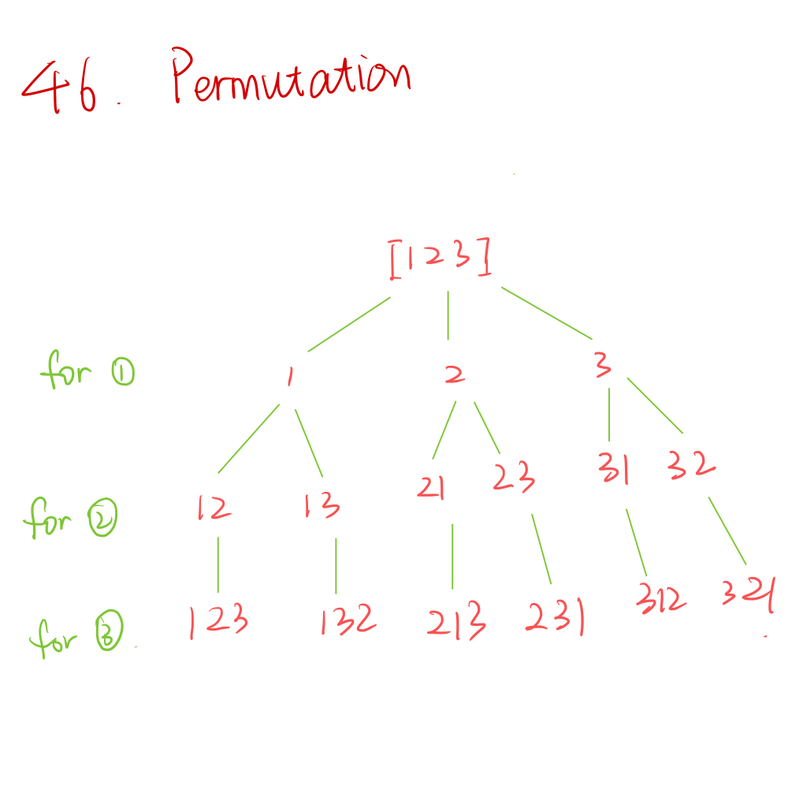

46. Permutations
    
Medium

Given an array nums of distinct integers, return all the possible permutations. You can return the answer in any order.

 

Example 1:

Input: nums = [1,2,3]
Output: [[1,2,3],[1,3,2],[2,1,3],[2,3,1],[3,1,2],[3,2,1]]
Example 2:

Input: nums = [0,1]
Output: [[0,1],[1,0]]
Example 3:

Input: nums = [1]
Output: [[1]]
 

Constraints:

1 <= nums.length <= 6
-10 <= nums[i] <= 10
All the integers of nums are unique.



```py
class Solution:
    def permute(self, nums: List[int]) -> List[List[int]]:
        if not nums:
            return None
        
        results = []
        visited = []
        self.dfs(nums, [], results, visited)
        return results
        
    def dfs(self, nums, currSubset, results, visited):
        if len(currSubset) == len(nums):
            results.append(list(currSubset))
            
        for i in range(len(nums)):
            if nums[i] in visited:
                continue
                
            visited.append(nums[i])
            currSubset.append(nums[i])
            self.dfs(nums, currSubset, results, visited)
            currSubset.remove(nums[i])
            visited.remove(nums[i])
```


