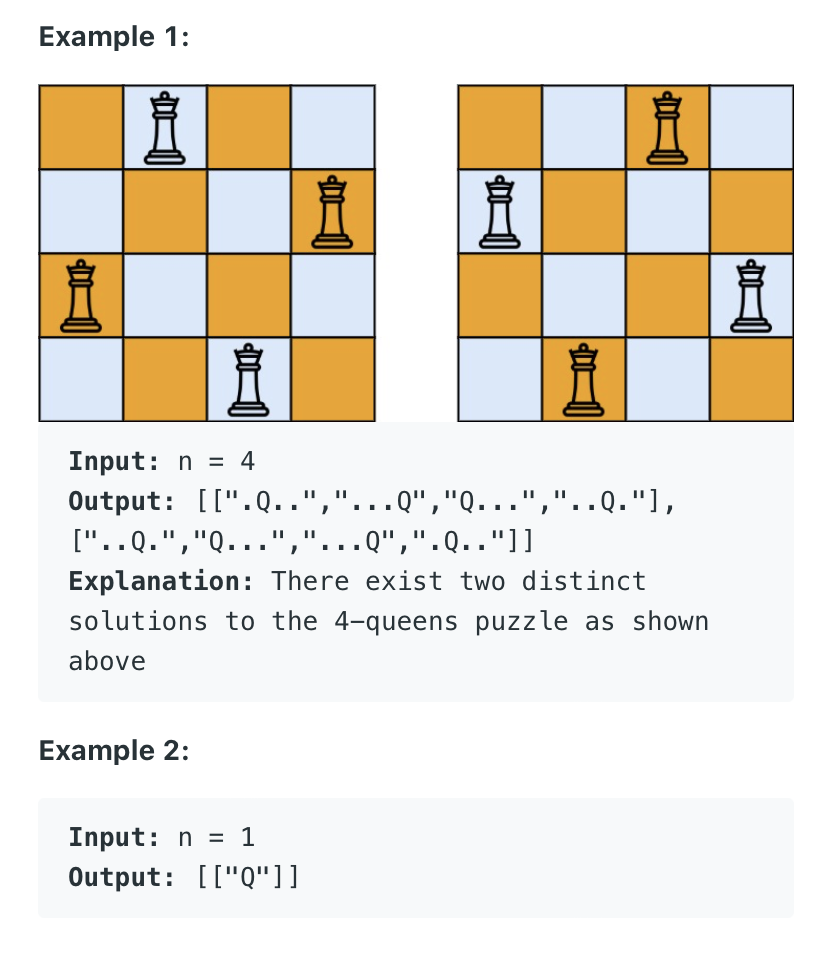

51. N-Queens
Hard

The n-queens puzzle is the problem of placing n queens on an n x n chessboard such that no two queens attack each other.

Given an integer n, return all distinct solutions to the n-queens puzzle. You may return the answer in any order.

Each solution contains a distinct board configuration of the n-queens' placement, where 'Q' and '.' both indicate a queen and an empty space, respectively.



Constraints:

1 <= n <= 9

## Version I:

### This version can pass tests but runtime is big

```py
class Solution:
    def solveNQueens(self, n: int) -> List[List[str]]:
        results = []
        all_pos = []
        self.dfs(n, results, all_pos)
        #print(results)
        results_str = self.convertResults(results, n)
        return results_str
    
    def dfs(self, n, results, all_pos):
        if len(all_pos) == n:
            all_pos = sorted(all_pos)
            if all_pos not in results:
                results.append(list(all_pos))
        
        # for one_possible in all_next_possible:
        for i in range(n):
            for j in range(n):
                # [i,j] is next possible position
                if not self.isValid(i, j, all_pos):
                    continue
                
                all_pos.append([i,j])
                self.dfs(n, results, all_pos)
                all_pos.pop()
                
    def isValid(self, i, j, all_pos):
        for one_pos in all_pos:
            if one_pos[0] == i or one_pos[1] == j:
                return False
            if abs(one_pos[0] - i) == abs(one_pos[1] -j):
                return False
            
        return True
    
    def convertResults(self, results, n):
        result_str = []
        for result in results:
            oneresultstr = []
            for i in range(n):
                rowstr = ""
                for j in range(n):
                    if result[i][0] == i and result[i][1] == j:
                        rowstr += "Q"
                    else:
                        rowstr += "."
                oneresultstr.append(rowstr)
            result_str.append(oneresultstr)
        return result_str
```

## Version II

### Optimize 1: all_pos VS all_pos_col.
    - all_pos record row and col coordinates [i, j]
    - all_pos_col only record the column position without row position
  
### Optimize 2: in dfs reduce one for-loop 
    - only need one for-loop for column
  
```py
class Solution:
    def solveNQueens(self, n: int) -> List[List[str]]:
        results = []
        all_pos = []
        self.dfs(n, results, all_pos)
        #print(results)
        results_str = self.convertResults(results, n)
        return results_str
    
    # all_pos_col only record the column position without row position
    def dfs(self, n, results, all_pos_col):
        if len(all_pos_col) == n:
            if all_pos_col not in results:
                results.append(list(all_pos_col))
        
        # for one_possible in all_next_possible:
        for col_j in range(n):
            # [i,j] is next possible position
            if not self.isValid(col_j, all_pos_col):
                continue

            all_pos_col.append(col_j)
            self.dfs(n, results, all_pos_col)
            all_pos_col.pop()
                
    def isValid(self, new_col_j, all_pos_col):
        new_row_i = len(all_pos_col)
        for one_pos_rowi, one_pos_colj in enumerate(all_pos_col):
            if one_pos_rowi == new_row_i or one_pos_colj == new_col_j:
                return False
            if abs(one_pos_rowi - new_row_i) == abs(one_pos_colj - new_col_j):
                return False
            
        return True
    
    def convertResults(self, results, n):
        result_str = []
        for result in results:
            oneresultstr = []
            for i in range(n):
                rowstr = ""
                for j in range(n):
                    if result[i] == j:
                        rowstr += "Q"
                    else:
                        rowstr += "."
                oneresultstr.append(rowstr)
            result_str.append(oneresultstr)
        return result_str
            
```


