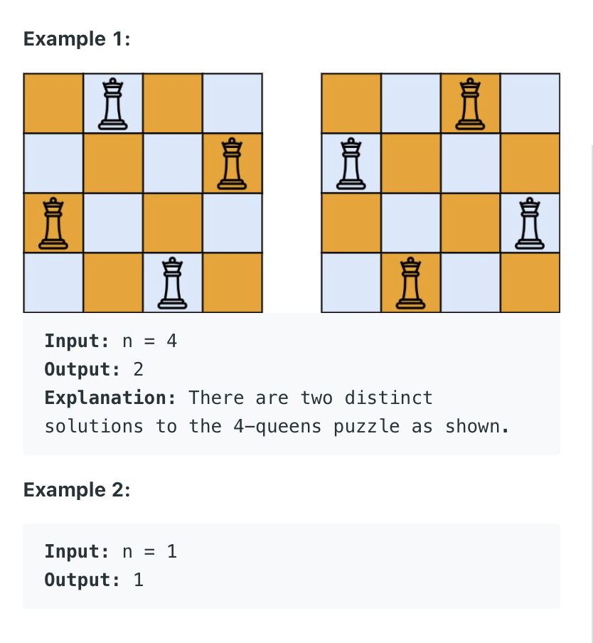

52. N-Queens II
    
Hard

The n-queens puzzle is the problem of placing n queens on an n x n chessboard such that no two queens attack each other.

Given an integer n, return the number of distinct solutions to the n-queens puzzle.




Constraints:

1 <= n <= 9


```py
class Solution:
    def totalNQueens(self, n: int) -> int:
        results = []
        all_pos = []
        self.dfs(n, results, all_pos)
        #print(results)
        return len(results)
    
    # all_pos_col only record the column position without row position
    def dfs(self, n, results, all_pos_col):
        if len(all_pos_col) == n:
            if all_pos_col not in results:
                results.append(list(all_pos_col))
        
        # for one_possible in all_next_possible:
        for col_j in range(n):
            # [i,j] is next possible position
            if not self.isValid(col_j, all_pos_col):
                continue

            all_pos_col.append(col_j)
            self.dfs(n, results, all_pos_col)
            all_pos_col.pop()
                
    def isValid(self, new_col_j, all_pos_col):
        new_row_i = len(all_pos_col)
        for one_pos_rowi, one_pos_colj in enumerate(all_pos_col):
            if one_pos_rowi == new_row_i or one_pos_colj == new_col_j:
                return False
            if abs(one_pos_rowi - new_row_i) == abs(one_pos_colj - new_col_j):
                return False
            
        return True
```

        