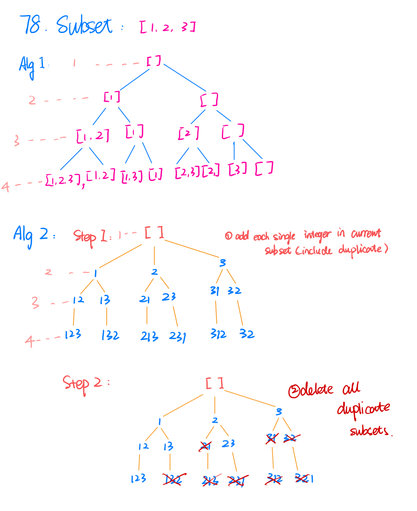

78. Subsets
    
Medium

Given an integer array nums of unique elements, return all possible subsets (the power set).

The solution set must not contain duplicate subsets. Return the solution in any order.

 

Example 1:

Input: nums = [1,2,3]
Output: [[],[1],[2],[1,2],[3],[1,3],[2,3],[1,2,3]]
Example 2:

Input: nums = [0]
Output: [[],[0]]
 

Constraints:

1 <= nums.length <= 10
-10 <= nums[i] <= 10
All the numbers of nums are unique.

### Method 1:    
```py
class Solution:
    def subsets(self, nums: List[int]) -> List[List[int]]:
        if not nums:
            return []
        
        results = []
        self.dfs(nums, 0, [], results)
        return results
        
    # 1. recursion definition
    def dfs(self, nums, curr_index, curr_subset, results):
        # 3. recursion stopping
        if curr_index >= len(nums):
            # deep copy
            results.append(list(curr_subset))
            # results.add(new ArrayList<>(curr_subset));
            return
        
        # 2. recursion divide
        # option 1 add the element
        curr_subset.append(nums[curr_index])
        self.dfs(nums, curr_index + 1, curr_subset, results)
        
        # option 2 don't add the element
        curr_subset.remove(nums[curr_index])#backtracking
        self.dfs(nums, curr_index + 1, curr_subset, results)
        
 # [1 2 3]
 #  1 0 0 -> [1]
 #  1 0 1 -> [1, 3]
 #  0 1 1 -> [2, 3]
```
        
### Method 2:
```py
class Solution:
    def subsets(self, nums: List[int]) -> List[List[int]]:
        if not nums:
            return []
        
        results = []
        self.dfs(nums, 0, [], results)
        return results
    
    def dfs(self, nums, curr_index, curr_subset, results):
        results.append(list(curr_subset))
        
        for i in range(curr_index, len(nums)):# only consider nums after curr_index
            # add all options except themselves
            curr_subset.append(nums[i]) # [1] -> [1, 2]
            self.dfs(nums, i + 1, curr_subset, results)
            # backtracking [1, 2] -> [1] this is for next iteration it can do [1] -> [1, 3]
            curr_subset.remove(nums[i])
```

```java
class Solution {
    public List<List<Integer>> subsets(int[] nums) {
        if (nums == null || nums.length == 0){
            return null;
        }
        List<List<Integer>> allsubsets = new ArrayList<>();
        ArrayList<Integer> currSubset = new ArrayList<>();
        this.dfs(nums, 0, currSubset, allsubsets);
        return allsubsets;
    }
    
    private void dfs(int[] nums, int currIndex, ArrayList<Integer> currSubset,  List<List<Integer>> allsubsets){
        allsubsets.add(new ArrayList<Integer>(currSubset));
        
        for (int i = currIndex; i < nums.length; i++){
            currSubset.add(nums[i]);
            this.dfs(nums, i + 1, currSubset, allsubsets);
            currSubset.remove(new Integer(nums[i]));
        }
    }
}
```


    