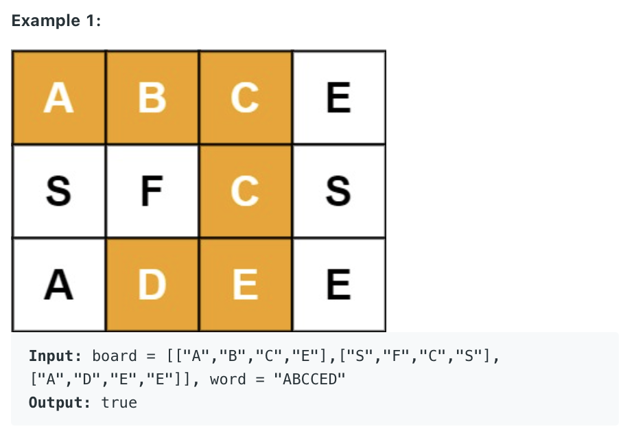
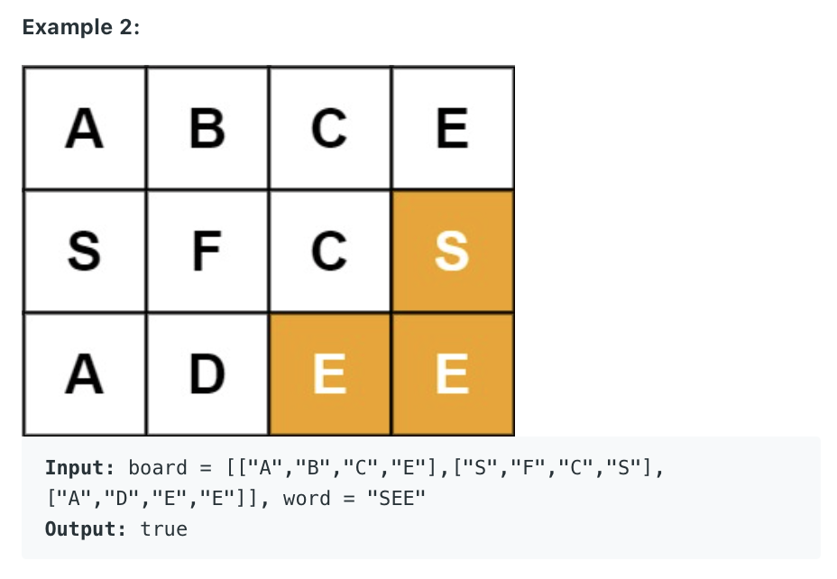
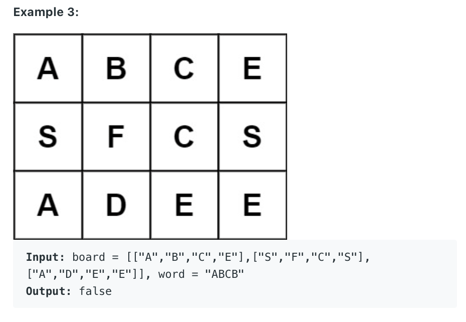

79. Word Search
    
Medium

Given an m x n grid of characters board and a string word, return true if word exists in the grid.

The word can be constructed from letters of sequentially adjacent cells, where adjacent cells are horizontally or vertically neighboring. The same letter cell may not be used more than once.



Constraints:

m == board.length
n = board[i].length
1 <= m, n <= 6
1 <= word.length <= 15
board and word consists of only lowercase and uppercase English letters.
 

Follow up: Could you use search pruning to make your solution faster with a larger board?

```py
offsets = [(0,1),(1,0),(0,-1),(-1,0)]
class Solution:
    def exist(self, board: List[List[str]], word: str) -> bool:
        if not board or not word:
            return False
        
        rleng = len(board)
        coleng = len(board[0])
        visited = [[False] * coleng for _ in range(rleng)]
        print(visited)
        
        for i in range(rleng):
            for j in range(coleng):
                print("board[iaaj] ", board[i][j] )
                print("word[0] ", word[0])
                if board[i][j] == word[0]:
                    visited[i][j] = True
                    found = self.dfs(board, word, i, j, word[0], visited)
                    visited[i][j] = False
                    if found:
                        return True
        return False
                    
    
    def dfs(self, board, word, x, y, currRes, visited):
        print("currRes ", currRes)
        if len(currRes) <= len(word):
            if currRes[-1] != word[len(currRes) - 1]:
                print("not match")
                return
            if currRes == word:
                found = True
                return found
     
        for offset in offsets:
            newx = x + offset[0] 
            newy = y + offset[1]
            if not (0 <= newx < len(board) and 0 <= newy < len(board[0])):
                continue
            if visited[newx][newy]:
                continue
                
            visited[newx][newy] = True
            tempfound = self.dfs(board, word, newx, newy, currRes + board[newx][newy], visited)
            visited[newx][newy] = False
            if tempfound:
                return True
        return False
```

### console:
```py
[[False, False, False, False], [False, False, False, False], [False, False, False, False]]

board[iaaj]  A
word[0]  A
currRes  A
currRes  AB
currRes  ABC
currRes  ABCE
not match
currRes  ABCC
currRes  ABCCS
not match
currRes  ABCCE
currRes  ABCCEE
not match
currRes  ABCCED
```
