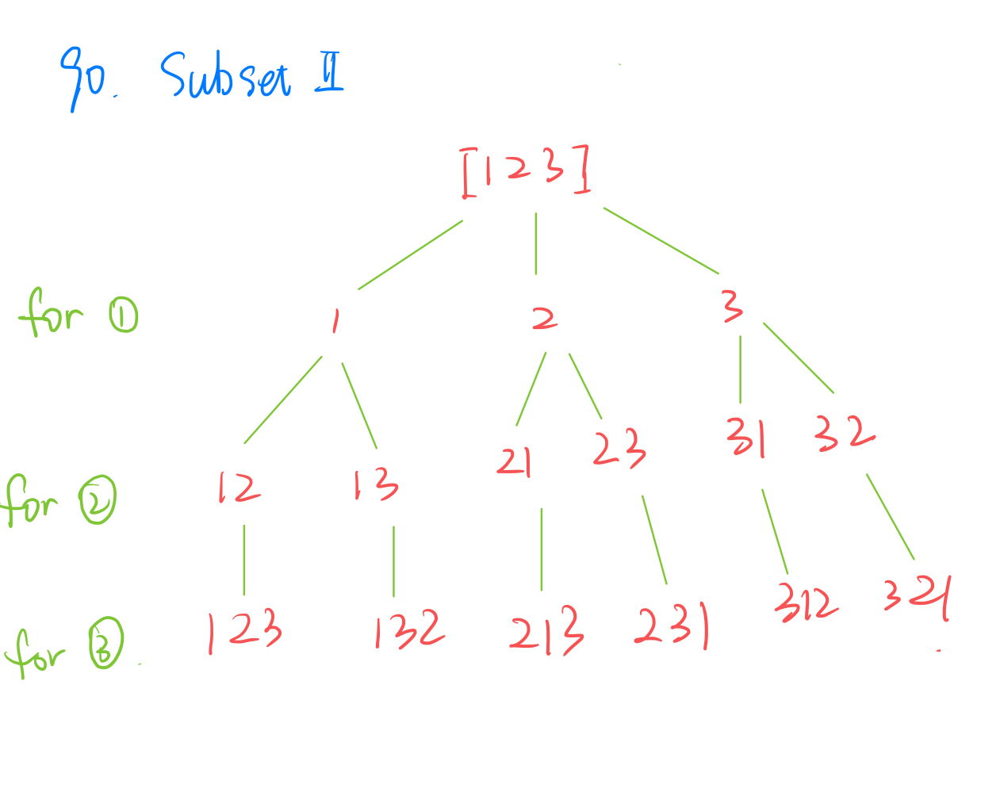

90. Subsets II
    
Medium

Given an integer array nums that may contain duplicates, return all possible subsets (the power set).

The solution set must not contain duplicate subsets. Return the solution in any order.

Example 1:

Input: nums = [1,2,2]
Output: [[],[1],[1,2],[1,2,2],[2],[2,2]]
Example 2:

Input: nums = [0]
Output: [[],[0]]
 
Constraints:

1 <= nums.length <= 10
-10 <= nums[i] <= 10


```py
class Solution:
    def subsetsWithDup(self, nums: List[int]) -> List[List[int]]:
        if not nums:
            return []
        
        nums = sorted(nums)
        results = []
        self.dfs(nums, 0, list(), results)
        return results
      
    def dfs(self, nums, currIndex, currSubset, results):
        if currSubset not in results:
            results.append(list(currSubset))
            
        for i in range(currIndex, len(nums)):
            currSubset.append(nums[i])
            self.dfs(nums, i + 1, currSubset, results)
            currSubset.remove(nums[i])
```
